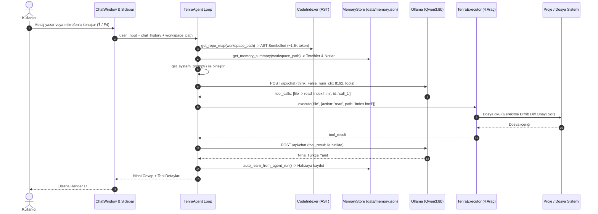

# 🛰️ TENRA 2.0 (COWORKER) — PROJE DURUM RAPORU, MİMARİ VE YOL HARİTASI
> **Hedef Kitle:** Başka bir Yapay Zeka (AI Coding Agent / Claude, GPT, Gemini vb.) veya İleri Düzey Geliştirici.  
> **Tarih:** 22 Eylül 2026  
> **Sürüm:** Tenra 2.0.0 (Beta / Aktif Geliştirme)  
> **Git Durumu:** `main` dalı senkronize, temiz.

---

## 1. YÖNETİCİ ÖZETİ VE VİZYON (EXECUTIVE SUMMARY)

**Tenra 2.0 (eski adıyla Coworker)**; Cursor, Windsurf ve Antigravity felsefesini yerel Windows masaüstüne getiren **otonom bir masaüstü ve proje geliştirici yapay zeka asistanıdır**.

### Temel Hedefler:
1. **Yerel & Bağımsız:** Tüm akıl yürütme kullanıcının kendi donanımında (NVIDIA RTX 5060, Ollama yerel API) gerçekleşir. Bulut API bağımlılığı yoktur.
2. **Projeye Kilitli (Workspace-Centric):** Kullanıcının seçtiği çalışma alanına (`workspace_path`) kilitlenir; PowerShell komutları, dosya okuma/yazma ve AST taramaları o dizine göre bağıl olarak çalışır.
3. **4 Çekirdek Araç (Minimal & Güçlü):** Eski versiyondaki 28+ karmaşık araç yerine 4 temel araçla (`shell`, `file`, `web`, `screen`) tüm bilgisayarı yönetir.
4. **Güvenlik & Güven (Human-in-the-Loop):** Sistem dizinleri sandboxing ile korunur, yıkıcı komutlar engellenir, tüm dosya değişiklikleri diskte uygulanmadan önce arayüzde Antigravity/Cursor tarzı **Renkli Unified Diff Kartı** ile kullanıcı onayına sunulur.
5. **AST Kod Haritası & Kalıcı Hafıza:** Tüm proje dosyalarını disk üzerinde AST ile ayrıştırıp 1.5k token'lık kompakt bir harita üretir; kalıcı hafıza (`memory.json`) ile kullanıcının tercihlerini ve geçmiş çözümlerini hatırlar.

---

## 2. DOSYA VE MODÜL MANİFESTOSU (TEKNİK DİZİN)

Proje kök dizini: `c:\Users\ahmet\OneDrive\Desktop\coworker`  
Yeni mimari tamamen `tenra/` paketi altında modüler olarak toplanmıştır:

| Dosya Yolu | Boyut | Sorumluluk ve Kritik Fonksiyonlar |
| :--- | :--- | :--- |
| `tenra/__main__.py` | 69 B | `python -m tenra` çalıştırma giriş noktası. `tenra.ui.app:main` tetikler. |
| `tenra/config.py` | 4.9 KB | Merkezi konfigürasyon, `MAIN_MODEL='qwen3:8b'`, `DEFAULT_NUM_CTX=8192`, dinamik `get_system_prompt()`, masaüstü yolu tespiti, AST Repo-Map ve Memory enjeksiyonu. |
| `tenra/core/llm_backend.py` | 4.1 KB | `OllamaBackend` sınıfı. Ollama `/api/chat` ve `/api/generate` bağlantıları. `think: False` bayrağı, 180s timeout, HTTP retry adapter ve hata ayrıştırma. |
| `tenra/core/agent.py` | 18.7 KB | Qwen3 çok adımlı tool calling döngüsü (`run_agent_loop`). Çoklu fallback'li araç ayrıştırma (`_extract_tool_calls`), `tool_call_id` yönetimi, vision/screenshot analizi (`Moondream`), konuşma geçmişi optimizasyonu ve hafızaya otomatik kayıt (`_record_run_memory`). |
| `tenra/core/executor.py` | 26.8 KB | **4 Çekirdek Araç Motoru (`TenraExecutor`):**<br>• `shell`: Proje dizininde PowerShell çalıştırma.<br>• `file`: `read`, `write`, `patch`, `delete`, `trash`, `list`, `search`, `find`. Difflib unified diff hesaplama, güvenli çöp kutusu (`send2trash`), Türkçe karakter/typo fonetik normalizasyonu.<br>• `web`: DuckDuckGo araması (`ddgs`) ve BeautifulSoup web kazıma.<br>• `screen`: PyAutoGUI tıklama/yazma, PyTesseract OCR ile ekrandaki metne tıklama (`click_text`).<br>• `_is_safe_path`: Windows sistem dizinleri sandboxing.<br>• `_is_dangerous_command`: Tehlikeli komut önleme. |
| `tenra/core/indexer.py` | 10.8 KB | **AST Kod Haritası ve Repo-Map Motoru (`CodeIndexer`):** Proje dosyalarını tarar; Python (`ast.parse`), JS/TS (Regex), HTML (Title/IDs), CSS (Selectors), JSON/MD özetlerini çıkarır. `data/indexes/idx_<hash>.json` dosyasında `mtime` bazlı önbelleğe alır. |
| `tenra/core/memory.py` | 7.8 KB | **Kalıcı ve Episodik Hafıza (`MemoryStore`):** `data/memory.json` içinde kullanıcı tercihlerini, proje mimari notlarını ve çözülen görevlerin derslerini (episodes) saklar ve prompta enjekte eder. |
| `tenra/core/workspace_manager.py`| 10.4 KB | Proje ve bağımsız sohbet oturumlarının yönetimi. `data/workspaces.json` okuma/yazma. Aktif proje değiştirme, yeni proje ekleme/silme. |
| `tenra/ui/app.py` | 3.4 KB | PySide6 `QApplication` başlatıcı, model ön yükleme (`preload`), arka plan görevleri ve bağımlılık kontrolü. |
| `tenra/ui/chat_window.py` | 60.0 KB | **Agent Studio Ana Arayüzü:** Çerçevesiz modern pencere, sağ panel canlı log konsolu, başlık çubuğunda 📌 Pin (en üstte kalma aç/kapa) butonu, girdi çubuğunda `🎙️` ses butonu, interaktif kod diff onay kartları (`make_diff_card_html`), tehlikeli komut onay kartları, dosya sürükle-bırak desteği. |
| `tenra/ui/sidebar_widget.py` | 14.3 KB | Sol kenar çubuğu. Projeler listesi, proje ekleme klasör seçicisi, projeye bağlı sohbetler ve bağımsız genel sohbetler ayrımı. |
| `tenra/ui/floating_widget.py`| 4.5 KB | Masaüstünde her zaman üstte duran, yarı saydam ve nabız atan Tenra logolu yüzen widget. Tıklanınca ana stüdyoyu açar/kapatır. |
| `tenra/ui/snipping.py` | 3.3 KB | Masaüstü ekran alıntısı (snipping) aracı. Seçilen bölgeyi kırpar ve doğrudan ajana gönderir. |
| `tenra/ui/markdown.py` | 7.9 KB | Zengin Markdown render motoru (kod blokları, tablolar, syntax renklendirme). |
| `tenra/voice/stt.py` | 2.6 KB | `VoiceListenerThread`: `SpeechRecognition` + `PyAudio` ile Türkçe (`tr-TR`) sesle yazma iş parçacığı. `Ctrl+M` ve `F4` kısayolları. |

---

## 3. VERİ AKIŞI VE ÇALIŞMA MİMARİSİ (DATA FLOW)



---

## 4. DÜRÜST HATA, DARBOĞAZ VE RİSK ANALİZİ (REALISTIC FLAWS & TECH DEBT)

Bu bölüm, projeyi devralacak yapay zekanın veya geliştiricinin **kesinlikle bilmesi gereken gerçek zafiyetleri ve mimari limitleri** listeler:

### ⚠️ Darboğaz 1: Qwen3 Akıl Yürütme (`think`) İkilemi
- **Mevcut Durum:** Qwen3 varsayılan olarak `<think>` etiketleri arasında 300–500 token'lık derin muhakeme yapar. Bu, her araç adımında 70–120 saniye gecikmeye yol açıyordu. Gecikmeyi çözmek için `think: False` eklendi ve yanıt süresi **1.28 saniyeye** düşürüldü.
- **Gerçekçi Sorun:** Basit dosya okuma ve komut çalıştırmada `think: False` mükemmel çalışır. Ancak karmaşık mantık, çok aşamalı algoritma tasarımı veya büyük mimari refactoring gerektiren durumlarda akıl yürütmenin kapatılması modelin problem çözme kalitesini düşürebilir.
- **Çözüm Planı:** Hibrit mod — Tek adımlı araç çağrılarında `think: False`, derin planlama modunda (`/think` veya karmaşık analiz sorgularında) `think: True` dinamik olarak tetiklenmeli.

### ⚠️ Darboğaz 2: Arayüzde Token Streaming (Canlı Akış) Eksikliği
- **Mevcut Durum:** `llm_backend.py` içinde `stream: False` kullanılmaktadır.
- **Gerçekçi Sorun:** Büyük bir dosya okunduğunda veya model uzun bir yanıt üretirken arayüzde sadece *"Tenra düşünüyor..."* göstergesi döner. Yanıt bittiğinde 3000 karakterlik metin bir anda ekrana düşer. Bu, kullanıcıda uygulamanın donduğu hissini yaratabilir.
- **Çözüm Planı:** Ollama SSE (Server-Sent Events) streaming motoru `chat_window.py`'a bağlanarak token'ların ekranda daktilo efektiyle anlık akması sağlanmalı.

### ⚠️ Darboğaz 3: AST İndeksleyicinin Regex Bağımlılığı (JS/TS/HTML Sınırları)
- **Mevcut Durum:** Python dosyaları Python'ın yerel `ast` kütüphanesiyle %100 kusursuz ayrıştırılır. Ancak JavaScript, TypeScript, HTML ve CSS dosyaları hafif regex modelleriyle taranır.
- **Gerçekçi Sorun:** Karmaşık React/Vue JSX bileşenleri, iç içe geçmiş ok fonksiyonları (nested arrow functions), TypeScript decorator'ları regex tarafından atlanabilir veya hatalı imzalanabilir.
- **Çözüm Planı:** Ağır Node.js bağımlılığı olmadan Tree-Sitter (veya `tree-sitter-languages` Python kütüphanesi) entegre edilerek tüm dillerde tam AST desteğine geçilmeli.

### ⚠️ Darboğaz 4: Düz JSON Hafıza (`memory.json`) ve Ölçeklenebilirlik
- **Mevcut Durum:** Hafıza düz bir `data/memory.json` dosyasında tutulur ve son 25 kayıt (FIFO) saklanır.
- **Gerçekçi Sorun:** Proje üzerinde aylar boyunca çalışıldığında eski ama kritik mimari kararlar (25 kaydın dışına çıktığında) silinir. Ayrıca anlamsal (semantic) arama yoktur; sadece çalışma alanı adına göre filtreleme yapılır.
- **Çözüm Planı:** Ollama'da zaten kurulu olan `nomic-embed-text` modeli kullanılarak yerel bir SQLite-Vec veya ChromaDB vektör veritabanı kurulmalı; kullanıcı sorgusuyla anlamsal olarak en yakın 3 geçmiş deneyim çekilmelidir.

### ⚠️ Darboğaz 5: Güvenlik Sandbox'ının Regex Baypas Edilebilirliği
- **Mevcut Durum:** `_is_dangerous_command` fonksiyonu `rm -rf`, `Format-Volume`, `reg delete` gibi kelimeleri regex ile yakalar.
- **Gerçekçi Sorun:** Bir model veya script `powershell -EncodedCommand ...` veya ortam değişkeni parçalama (`iex ($a+$b)`) kullanırsa statik regex denetimi atlatılabilir.
- **Çözüm Planı:** PowerShell ExecutionPolicy kısıtlamaları veya `RestrictedLanguage` runspace modu eklenmelidir. Ayrıca diff önizlemesi yalnızca `file` aracıyla sınırlı kalmamalı; `shell` aracının PowerShell üzerinden dosya oluşturma/değiştirme girişimleri de yakalanmalıdır.

### ⚠️ Darboğaz 6: Sesle Dikte (STT) İnternet Bağımlılığı
- **Mevcut Durum:** `tenra/voice/stt.py`, Google Speech API kullanır (`recognize_google`).
- **Gerçekçi Sorun:** İnternet bağlantısı kesildiğinde veya Google servislerine erişilemediğinde sesle yazma çöker ya da thread takılı kalır.
- **Çözüm Planı:** Yerel ve çevrimdışı çalışan `faster-whisper` (küçük `base.tr` veya `tiny.tr` modeli) yerel yedek olarak bağlanmalıdır.

---

## 5. GERÇEKÇİ VE AŞAMALI YOL HARİTASI (ACTIONABLE ROADMAP)

Projeyi devralacak yeni AI veya geliştirici aşağıdaki sıralı fazları takip etmelidir:

```
┌────────────────────────────────────────────────────────────────────────┐
│  FAZ 1: Kullanıcı Deneyimi & Hız (Immediate - 1-2 Gün)                │
│  • Token Streaming: Ollama stream=True ile harf harf akıtma           │
│  • Dinamik Think Modu: Basit eylemlerde think=False, derin analizde True│
│  • Shell Güvenlik Sıkılaştırma: Encoded PowerShell komutlarını bloklama│
└────────────────────────────────────┬───────────────────────────────────┘
                                     │
┌────────────────────────────────────▼───────────────────────────────────┐
│  FAZ 2: Vektörel RAG & Derin Öğrenme Hafızası (1 Hafta)                │
│  • nomic-embed-text ile yerel vektör indeksi (200k+ token simülasyonu) │
│  • SQLite-vec tabanlı anlamsal hafıza ve otomatik kod parçacığı arama │
│  • Tree-sitter ile TS/JS/HTML için %100 hassas AST desteği             │
└────────────────────────────────────┬───────────────────────────────────┘
                                     │
┌────────────────────────────────────▼───────────────────────────────────┐
│  FAZ 3: Otonom Ajan Kabiliyetleri (Antigravity Parity - 2 Hafta)       │
│  • Çoklu Dosya Diff Paketleme: Tek seferde 3 dosyayı düzenleyip tek diff│
│  • Geri Alma (Rollback/Undo): Beğenilmeyen kod değişikliğini tek tıkla  │
│  • Hermes 3 Sansürsüz / Hack Modu Yuvası (`_hermes_slot.py` aktivasyonu)│
│  • Çevrimdışı Whisper STT ve Piper TTS (Sesli Yanıt Verme)             │
└────────────────────────────────────┬───────────────────────────────────┘
                                     │
┌────────────────────────────────────▼───────────────────────────────────┐
│  FAZ 4: Dağıtım ve Üretim Hazırlığı (Production Packaging)             │
│  • Windows System Tray arka plan servisi                               │
│  • PyInstaller / InnoSetup ile tek tıkla kurulan .exe paketi          │
│  • Otomatik pytest ve regresyon test süiti                             │
└────────────────────────────────────────────────────────────────────────┘
```

---

## 6. YENİ BİR YAPAY ZEKA İÇİN BAŞLANGIÇ KILAVUZU (AI HANDOVER BRIEF)

Eğer bu depoyu başka bir yapay zekaya (Cursor, Claude Code, Devins vb.) yüklüyorsanız, ona şu komutla talimat verin:

> *"Tenra 2.0 deposundasın. Lütfen `PROJECT_STATUS_AND_ROADMAP.md` dosyasını oku. Mimariyi, `tenra/` altındaki 4 çekirdek aracı, AST indexer'ı ve hafıza sistemini anla. Şu anda [İlgili Görev/Faz] üzerinde çalışacağız. Kod düzenlemelerini `tenra/` modüler yapısına uygun yap ve doğrudan PowerShell komutlarıyla test et."*

### Hızlı Test ve Geliştirme Komutları (PowerShell):

1. **Sanal Ortamı Aktif Etme ve Bağımlılıklar:**
   ```powershell
   cd "c:\Users\ahmet\OneDrive\Desktop\coworker"
   .\.venv\Scripts\Activate.ps1
   pip install -r requirements.txt
   ```

2. **Ollama ve Model Durumunu Denetleme:**
   ```powershell
   ollama list
   ollama ps
   ```

3. **AST Kod Haritasını ve Hafızayı Test Etme:**
   ```powershell
   $env:PYTHONIOENCODING="utf-8"
   .\.venv\Scripts\python -c "from tenra.config import get_system_prompt; print(get_system_prompt())"
   ```

4. **Uçtan Uca Ajan Döngüsünü Doğrulama:**
   ```powershell
   $env:PYTHONIOENCODING="utf-8"
   .\.venv\Scripts\python -c "from tenra.core.executor import TenraExecutor; from tenra.core.agent import run_agent_loop; ex = TenraExecutor(); res = run_agent_loop('Masaüstünde ne var?', ex); print(res['reply'])"
   ```

5. **Uygulamayı Canlı Çalıştırma:**
   ```powershell
   .\.venv\Scripts\python -m tenra
   ```

---

## 7. SONUÇ VE TAAHHÜTLER

Tenra 2.0, şişirilmiş ve çalışmayan eski kod yığınından (tenra_v5 / 28+ araç) arındırılmış; **temiz, otonom, güvenli ve gerçek AST tabanlı modern bir AI geliştirici stüdyosuna** dönüştürülmüştür. Bu dokümanda listelenen gerçekçi eksiklikler sistemin çalışmasını engellemeyen, ancak bir sonraki seviyeye (Endüstriyel Seviye Antigravity / Cursor) taşınması için atılması gereken somut adımlardır.
